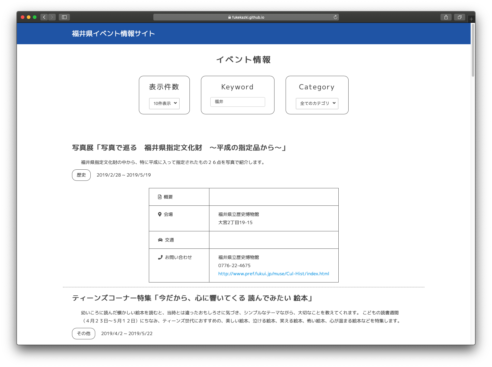

# 福井県イベント情報サイト

    

URL: https://fukekazki.github.io/jigInternTask-FukeKazuki-/

## Description
福井県のイベント情報サイトです.  
jig.jpのインターンの課題で作成しました.  

## 開発環境
### 言語
- **JavaScript**
- **HTML**
- **CSS**
### フレームワーク
- **jQuery**
- **SCSS**
    - SMACSS設計
    
### エディタ
- **PhpStorm**

## 機能
- **イベント情報の一覧表示**
- **表示件数の切り替え**
- **「もっと見る」で続きを表示**
- **カテゴリでの絞り込み**
- **キーワード検索(イベント名, 開催地)**